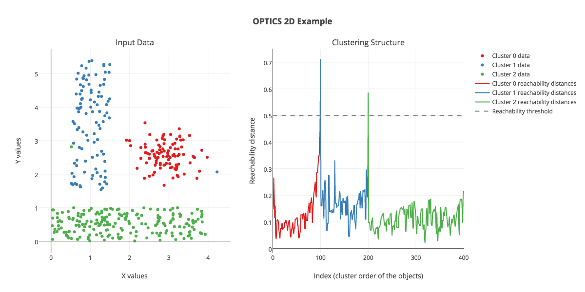

# OPTICS demo
More about [OPTICS](https://en.wikipedia.org/wiki/OPTICS_algorithm) clustering.



## Installation

* Install `pyclustering`:
```
git clone https://github.com/annoviko/pyclustering
cd pyclustering
pip install . --user

```

* Install other requirements:
```
pip install -r requirements.txt --user
```

## Run

```
python optics.py
```

This should generate a couple of `.html` files. Open them in your web 
browser to visualize the results of OPTICS clustering. 